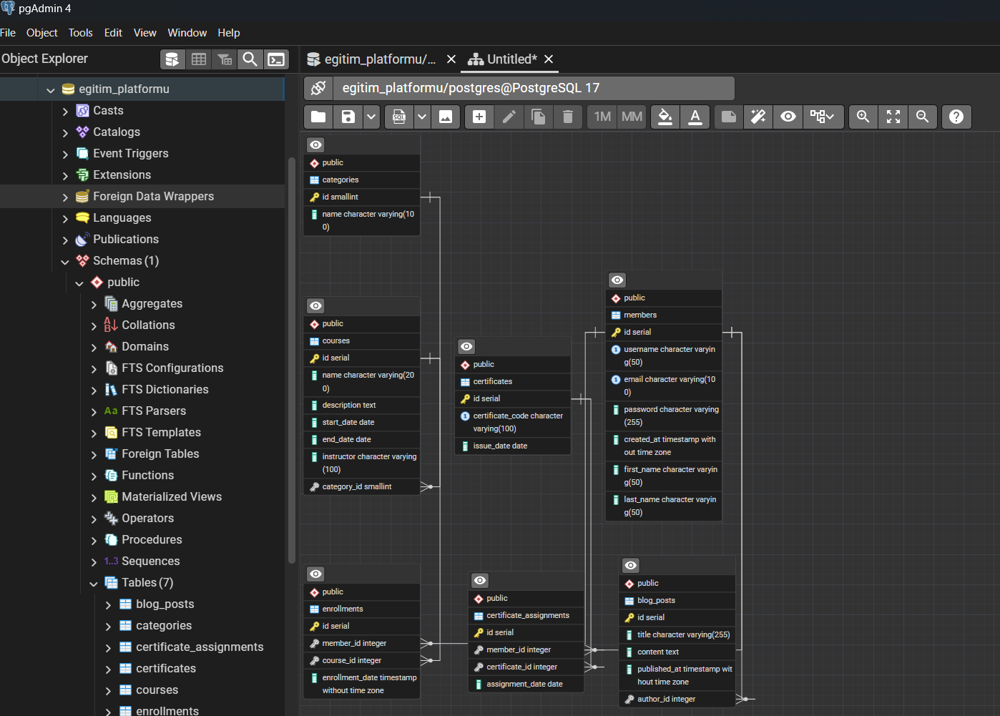

# TurkStudentCo Data Science Bootcamp SQL (Şubat–Nisan 2025) 🧑‍💻

## 📚 Eğitmen:
- **Tuncay Tiryaki**

📆 Bu çalışma, Şubat–Nisan 2025 tarihleri arasında yürütülen **TurkStudentCo SQL Bootcamp** süresince yapılan **SQL ödevleri** ve **Final Projesi**ni içermektedir.

---

## 📂 İçindekiler

1. **HomeWork1.sql** – İlk ödev: Employees ve Departments tabloları üzerinde temel SQL sorguları ve veri işlemleri.
2. **HomeWork2.sql** – İkinci ödev: Invoice tablosu üzerinde veri analizi ve sorgulama işlemleri. 
3. **HomeWork3.sql** – Üçüncü ödev: Track, Playlist, Album ve Artist tablolarında JOIN, tarih filtreleme, toplama ve sıralama sorguları işlemleri.
4. **FinalProject/** – Final Proje: PostgreSQL ile Çevrimiçi Eğitim Platformu için veritabanı şeması tasarımı.
   - 📄 `FinalProject.sql` – Açıklamalı SQL tablo tanımları (PK/FK ilişkileriyle)
   - 🖼️ `ERD.png` – Tablolar arası ilişkileri gösteren veritabanı diyagramı
   - 🔸 sample_data.sql – Tabloları test etmek için örnek veri kayıtlarını içerir.
   - 👉 Daha fazla bilgi için: [`FinalProject/README_placeholder.md`](FinalProject/README_placeholder.md)

---

## 🖼️ Final Proje ER Diyagramı

---

## 🔗 Bağlantılar:
- [**Linktree**](https://linktr.ee/arzubesiroglu)

---

## 📝 Teşekkürler!
Bu repository'yi ziyaret ettiğiniz için teşekkürler! 😊  
Beğendiyseniz ⭐ bırakmayı, 🔀 forklamayı ve 👥 paylaşmayı unutmayın!

👉 İyi çalışmalar ve bol SQL'li günler! 🧑‍💻
---

